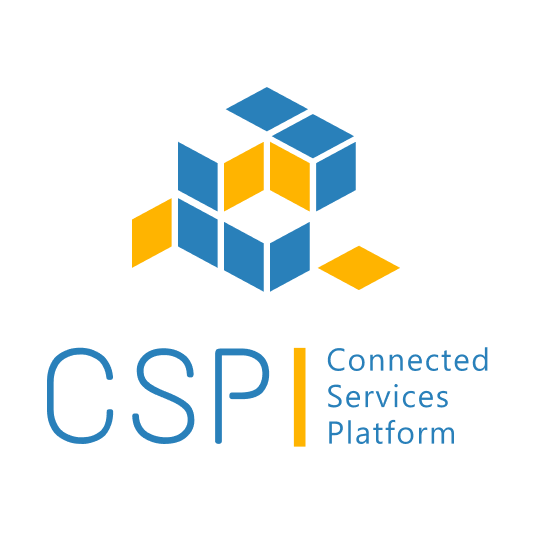

[](./images/logo.png)

[](https://opensource.org/licenses/Apache-2.0)
[](https://github.com/eclipse-ecsp/uidam-portal/releases)

# UIDAM Portal

Modern web-based admin portal for UIDAM (User Identity and Access Management) system. This portal provides comprehensive UI for managing users, accounts, roles, scopes, and OAuth2 clients in the UIDAM ecosystem.

# Table of Contents
* [Getting Started](#getting-started)
* [Usage](#usage)
* [How to contribute](#how-to-contribute)
* [Built with Dependencies](#built-with-dependencies)
* [Code of Conduct](#code-of-conduct)
* [Contributors](#contributors)
* [Security Contact Information](#security-contact-information)
* [Support](#support)
* [Troubleshooting](#troubleshooting)
* [License](#license)
* [Announcements](#announcements)

## Getting Started

UIDAM Portal is a React-based web application built with modern technologies including React 18, TypeScript, Material-UI, and Vite. It provides an intuitive interface for administrators to manage the complete UIDAM ecosystem.

### Prerequisites

1. Node.js version 18.0.0 or higher
2. npm version 9.0.0 or higher
3. Access to running instances of:
   - [UIDAM User Management](https://github.com/eclipse-ecsp/uidam-user-management) service
   - [UIDAM Authorization Server](https://github.com/eclipse-ecsp/uidam-authorization-server) service

### Installation

1. Clone the repository:
```bash
git clone https://github.com/eclipse-ecsp/uidam-portal.git
cd uidam-portal
```

2. Install dependencies:
```bash
npm install
```

3. Configure environment variables:
```bash
cp .env.example .env
```

Edit `.env` file with your UIDAM backend service URLs:
```
VITE_USER_MANAGEMENT_API=http://localhost:8080/api
VITE_AUTH_SERVER_URL=http://localhost:9443
```

### Running Locally

#### Development Mode
```bash
npm run dev
```

The application will be available at `http://localhost:5173`

#### Build for Production
```bash
npm run build
```

#### Preview Production Build
```bash
npm run preview
```

### Running with Docker

1. Build the Docker image:
```bash
docker build -t uidam-portal:latest .
```

2. Run the container:
```bash
docker run -p 8080:80 uidam-portal:latest
```

The application will be available at `http://localhost:8080`

### Running the Tests

#### Unit Tests
```bash
npm test
```

#### Watch Mode
```bash
npm run test:watch
```

#### Coverage Report
```bash
npm run test:coverage
```

### Code Quality

#### Linting
```bash
npm run lint
```

#### Auto-fix Linting Issues
```bash
npm run lint:fix
```

#### Format Code
```bash
npm run format
```

#### Type Checking
```bash
npm run type-check
```

## Usage

UIDAM Portal provides comprehensive management capabilities for:

### User Management
- Create, edit, and delete users
- Assign users to accounts
- Manage user roles and permissions
- View user details and activity

### Account Management
- Create and manage accounts
- Assign roles to accounts
- Configure account-level permissions
- Monitor account status

### Role Management
- Define and manage roles
- Configure role-based access control
- Assign scopes to roles
- View role hierarchy

### Scope Management
- Create and manage OAuth2 scopes
- Configure scope permissions
- Associate scopes with clients and roles

### Client Management
- Register OAuth2 clients
- Configure client credentials
- Manage client scopes and grants
- Monitor client activity

### User Approval Workflow
- Review and approve new user registrations
- Manage pending user requests
- Configure approval policies

### Dashboard
- View system overview
- Monitor key metrics
- Track recent activities
- Generate reports

## Architecture

The portal follows a modern React architecture:

### Technology Stack
- **React 18**: UI framework
- **TypeScript**: Type-safe development
- **Material-UI (MUI)**: Component library
- **React Router**: Client-side routing
- **Redux Toolkit**: State management
- **TanStack Query**: Server state management
- **React Hook Form + Yup**: Form handling and validation
- **Axios**: HTTP client
- **Vite**: Build tool
- **Jest**: Testing framework

### Project Structure
```
src/
├── components/       # Reusable UI components
├── features/         # Feature-based modules
│   ├── account-management/
│   ├── user-management/
│   ├── role-management/
│   ├── scope-management/
│   ├── client-management/
│   ├── user-approval/
│   ├── dashboard/
│   └── auth/
├── config/           # Application configuration
├── theme/            # MUI theme customization
└── types/            # TypeScript type definitions
```

## Built With Dependencies

* [React](https://react.dev/) - UI library
* [TypeScript](https://www.typescriptlang.org/) - Programming language
* [Material-UI](https://mui.com/) - React component library
* [Vite](https://vitejs.dev/) - Build tool and dev server
* [Redux Toolkit](https://redux-toolkit.js.org/) - State management
* [TanStack Query](https://tanstack.com/query/) - Data fetching and caching
* [React Router](https://reactrouter.com/) - Routing library
* [React Hook Form](https://react-hook-form.com/) - Form management
* [Yup](https://github.com/jquense/yup) - Schema validation
* [Axios](https://axios-http.com/) - HTTP client
* [Jest](https://jestjs.io/) - Testing framework
* [Testing Library](https://testing-library.com/) - Testing utilities
* [Nginx](https://nginx.org/) - Web server (for Docker deployment)

## How to contribute

Please read [CONTRIBUTING.md](./CONTRIBUTING.md) for details on our contribution guidelines, and the process for submitting pull requests to us.

## Code of Conduct

Please read [CODE_OF_CONDUCT.md](./CODE_OF_CONDUCT.md) for details on our code of conduct.

## Contributors

Check here the list of [contributors](https://github.com/eclipse-ecsp/uidam-portal/graphs/contributors) who participated in this project.

## Security Contact Information

Please read [SECURITY.md](./SECURITY.md) to raise any security related issues.

## Support

For questions and support, please open an issue on the [GitHub issue tracker](https://github.com/eclipse-ecsp/uidam-portal/issues).

## Troubleshooting

### Common Issues

#### Application won't start
- Ensure Node.js version 18+ is installed
- Delete `node_modules` and `package-lock.json`, then run `npm install` again
- Check that all required environment variables are set

#### Cannot connect to backend services
- Verify that UIDAM User Management and Authorization Server are running
- Check the API URLs in your `.env` file
- Ensure CORS is properly configured on backend services

#### Build fails
- Run `npm run type-check` to identify TypeScript errors
- Run `npm run lint` to identify code quality issues
- Ensure all dependencies are properly installed

## License

This project is licensed under the Apache-2.0 License - see the [LICENSE](./LICENSE) file for details.

## Announcements

All updates to this component are present in our [releases page](https://github.com/eclipse-ecsp/uidam-portal/releases).

For the versions available, see the [tags on this repository](https://github.com/eclipse-ecsp/uidam-portal/tags).
